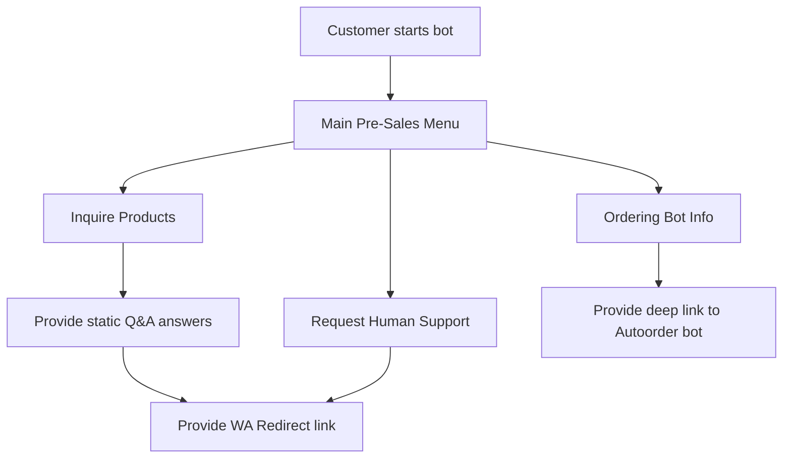

# Customer Support (CS) Assistant Bot Implementation Plan

This document outlines the scope, functional requirements, and architecture plan for the upcoming Telegram Customer Support Bot (`assistant`).

---

## 1. Core Framework & Libraries
- **Framework**: `aiogram` (v3.x) - An asynchronous Python library for the Telegram Bot API.
- **Bot Type**: Official Telegram Bot running via token issued by `@BotFather` (not a user session client).
- **Database**: SQLite for tracking chat sessions, history, and status routing.

---

## 2. Functional Scope

### A. Product Inquiry Handling
- Greet users automatically and handle basic product inquiries using a structured pre-sales menu.
- **Communication Tone**: Professional, helpful, friendly, and sales-focused.
- **Strict Information Boundaries**:
  - The bot **must not invent** stock levels or product pricing details.
  - The bot **must not perform** payment validations or order transactions directly.
  - If a user asks a question beyond the static database/pre-sales menu capabilities, the bot will route the query to a human representative.

### B. Routing & Contact Handoff
- **WhatsApp Handoff**: Provide direct, one-click redirect links to the WhatsApp support team (`https://wa.me/...`) for personalized sales assistance or complex inquiries.
- **Auto-Order Bot Redirection**: If the customer requests auto-ordering or purchase workflows that are supported by the existing ordering system, the bot should present direct instructions and deep links to start the ordering bot.

---

## 3. Database Schema (Planned)
```sql
CREATE TABLE IF NOT EXISTS sessions (
    user_id INTEGER PRIMARY KEY,
    username TEXT,
    full_name TEXT,
    last_interaction_at TEXT,
    state TEXT
);

CREATE TABLE IF NOT EXISTS support_tickets (
    ticket_id INTEGER PRIMARY KEY AUTOINCREMENT,
    user_id INTEGER,
    query TEXT,
    status TEXT DEFAULT 'open',
    created_at TEXT
);
```

---

## 4. Operational Flow Diagram


